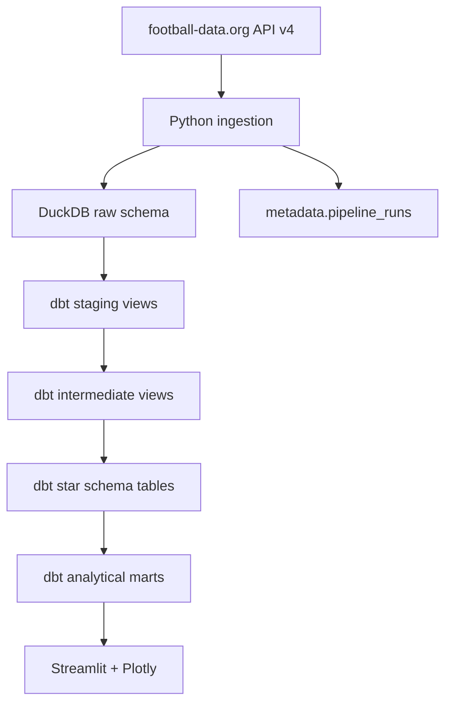
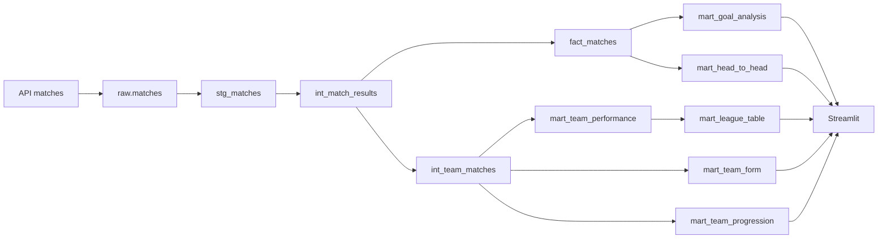
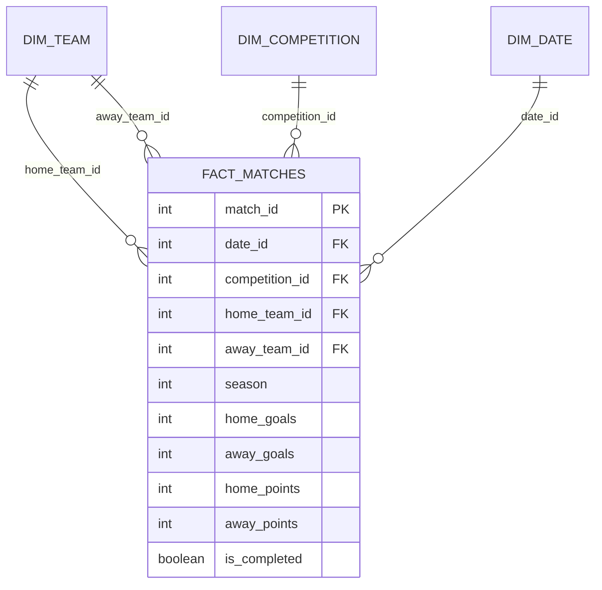

# Architecture and lineage

## Data movement

1. Python requests competitions, season teams, matches and standings with the `X-Auth-Token` header. It retries transient failures and records a run status.
2. DuckDB `raw` tables retain source fields and the source JSON in `_payload`. Stable IDs make each load an upsert. All four raw tables commit as one batch.
3. dbt staging views handle names, types, UTC match dates and deduplication. They define a clean contract for downstream SQL.
4. Intermediate views calculate completed-match results and two team-perspective rows per completed match.
5. Dimensions and `fact_matches` form a star schema. The fact grain is exactly one match, including scheduled fixtures. Measures stay null until a match is finished with scores.
6. Analytical marts serve dashboard cards, rankings, comparisons and progression charts. The dashboard reads them without recalculating points or results.

## Match lineage

## Star schema

`dim_competition` has one row per competition and carries its current season from the API. Multi-season analysis uses `fact_matches.season` and `season_id`; they remain on the fact because the competition dimension is not season-grained. `dim_team` includes match-participant IDs absent from the latest teams response, using the match name as a fallback.

## Operational behavior

The first local ingestion for a competition and season loads its full match list. Later local runs request only a rolling window, defaulting to three days back through seven days forward. The API's `dateTo` boundary is exclusive, so the request extends one extra day. Set `FOOTBALL_FULL_REFRESH=true` for a full reload. Competition, team and official standing data are refreshed every run.

The scheduled GitHub job starts on a fresh runner, so it performs a full load each day and uploads the resulting DuckDB file as a short-lived artifact. That artifact does not update a local dashboard until downloaded. A persistent cloud store or artifact restore step would be needed for incremental scheduled runs across GitHub jobs.
